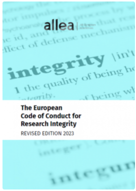
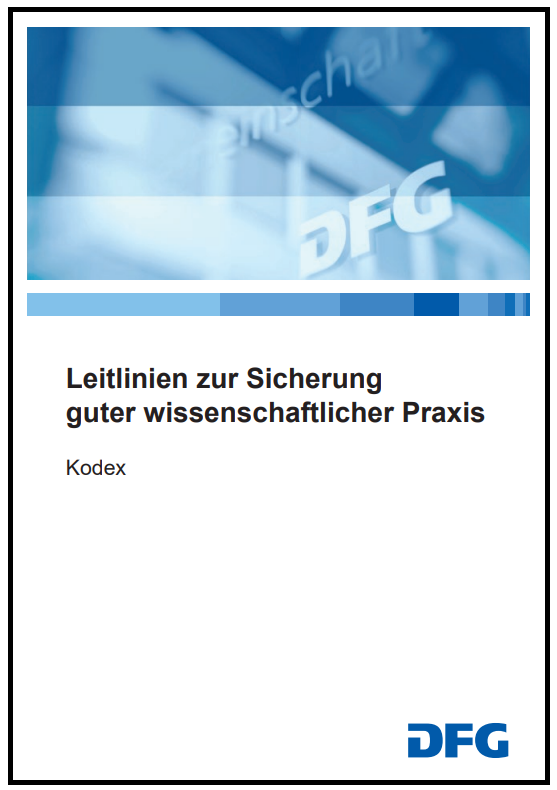

<!--

author:   Linda Zollitsch, Britta Petersen
email:    zollitsch@ub..uni-kiel.de
version:  0.1.0
language: de
narrator: DE Deutsch Female

icon:     images/Logo_cau-norm-de-lilagrey-rgb-0720_2022.png

comment:  This document provides a brief introduction to good research practice for lecturers As well as some didactic and methodologies for teaching grp to students.

-->

# Gute wissenschaftliche Praxis in der Lehre

Herzlich Willkommen zum Workshop **Gute wissenschaftliche Praxis und Forschungsdatenmanagement in der Lehre**.

> To see this document as an interactive LiaScript rendered version, click on the
> following link/badge:
>
> 
>
> If you have questions, please contact us: [Central Research Data Management](https://www.datamanagement.uni-kiel.de/de)
>
> This work is licenced under CCBY (https://creativecommons.org/licenses/by/4.0/)

-----

Dieser Workshop beschäftigt sich mit den Richtlinien und Codes, die die Grundlage guter wissenschftlicher Praxis bilden. Zudem werden immer wieder didaktische Möglichkeiten aufgezeigt, das Thema in die eigene Lehre zu integrieren.

Die verwendeten Illustrationen wurden, wo nicht anders angegeben, von Cleo Michelsen erstellt.

-----

## Kennenlernen

> **Lassen Sie uns zum Kennenlernen ein kleines Spiel spielen:**
>
> Verdecken Sie Ihre Kamera mit einem Post-it oder einem Finger.
>
> Ich lese Aussagen vor.
>
> Bei jeder Aussage, der Sie zustimmen können, zeigen Sie sich bitte wieder und winken kurz in die Kamera.
>
> Los geht's!

{{1-2}}
********************************************************************************

>
Ich trinke morgens gerne Kaffee.

********************************************************************************

{{2-3}}
********************************************************************************

>
Ich habe bereits viel Erfahrung mit guter wissenschaftlicher Praxis.

********************************************************************************

{{3-4}}
********************************************************************************

>
Wenn ich mich entscheiden muss, ob ich ins Kino oder in ein Konzert gehe, entscheide ich mich wahrscheinlich für das Konzert.

********************************************************************************

{{4-5}}
********************************************************************************

>
Ich habe ein Haustier.

********************************************************************************

{{5-6}}
********************************************************************************

>
Ich baue gute wissenschaftliche Praxis bereits in meine Lehre ein.

********************************************************************************

---

## Ziele des Lernmoduls 🎯

Das Lernmodul soll wichtige Aspekte näher bringen, die im Umgang mit wissenschaftlichen Daten zu beachten sind.

> Nach Bearbeitung dieses Lernmoduls sind Sie in der Lage...
>
> * ... einen verantwortungsvollen Umgang mit Daten beschreiben.
>
> * ... die Grundprinzipien guter wissenschaftlicher Praxis erläutern.
>
> * ... Gründe für gute wissenschaftliche Praxis benennen. 
>
> * ... gute wissenschaftliche Praxis in die Lehre integrieren.

-----

## Limitationen 🚧

Aus zeitlichen Gründen werden wir heute nur einige grundlegende Aspekte dessen, was es über gute wissenschaftliche Praxis zu wissen gibt, behandeln.

Wir werden uns keine disziplinspezifischen Inhalte anschauen, diese dürfen von Ihnen aber sehr gerne in die Diskussionen mit eingebracht werden.

Zum Ende des Workshops nehmen wir gerne Ihre Wünsche für weiterführende/vertiefende Workshopthemen auf.

---

## Einstieg

Zum Warm-up eine Einstiegsfrage zum Thema gute wissenschaftliche Praxis.

-----

{{1-2}}
********************************************************************************
Für sein erstes Forschungsprojekt an der Universität möchte Tim herausfinden, wie er den Prinzipien einer verantwortungsvollen Forschung folgen kann und was er dabei beachten muss. Um guten Forschungspraktiken zu folgen, sollte Tim ...

    [[ ]] auf der Grundlage dessen vorgehen, was seine Kommilitonen ihm raten.
    [[X]] sich mit den Richtlinien der Universität für gute Forschungspraktiken befassen.
    [[ ]] in der Presse nach Beispielen suchen.
    [[ ]] einfach mit der Arbeit beginnen und während dessen lernen.
********************************************************************************

{{2-3}}
********************************************************************************
Tims Entscheidung entspricht guter Forschungspraxis, denn ...

    [[ ]] alle machen es so.
    [[ ]] Forschung ist kreativ und darf nicht durch Regeln eingeschränkt werden.
    [[ ]] es spart wertvolle Ressourcen.
    [[X]] es gewährleistet zuverlässige Forschungsergebnisse.

********************************************************************************

{{3}}
********************************************************************************
Waren Sie in der Auswahl einer Praktik und in der Begründung sicher? Sehen Sie eine andere Begründung als die Richtige an? Was glauben Sie, wie Ihre Studierenden hierauf geantwortet hätten? Bei dieser Warm-up Frage geht es nicht darum, dass die Antwort auf alle Zeit allgemeingültig ist, sondern dem aktuellen Verständnis innerhalb der Wissenschaftsgemeinschaft entspricht. Das kann sich selbstverständlich im Laufe der Zeit verändern, sehen Sie die von uns angegebene "richtige" Begründung daher als ein Disksussions- und Reflektionsangebot Ihrer eigenen Perspektive an.

********************************************************************************

# Gute wissenschaftliche Praxis

{{1-3}}
********************************************************************************
Was ist gute wissenschaftliche Praxis und warum?

********************************************************************************

{{2-3}}
********************************************************************************

> Betrifft: 
>
> * redliches Denken und Handeln
> * organisations- und verfahrensrechtliche Regelungen

Sorgt für:

 * Vertrauenswürdigkeit der Wissenschaft

 *  Vertrauen der Gesellschaft in Wissenschaft

> wissenschaftliche Selbstverpflichtung

Respektvoller Umgang mit: 

 * Studienteilnehmer:innen
 * Tieren
 * Kulturgütern und Umwelt

********************************************************************************

{{3}}
********************************************************************************
Was hat gute wissenschaftliche Praxis mit der Lehre zu tun? 

********************************************************************************

{{4}}
********************************************************************************

* Ungang mit Forschungsdaten und wissenschaftlichen Daten lehren und lernen
  
    * Was darf ich mit Daten (Texten, Bildern, Videos, Ehebungsdaten...) machen?
      
    * Woran erkenne ich, ob es wissenschaftlich fundierte Daten sind?
      
    * Wie kann ich eigene Arbeiten transparent machen und mit anderen teilen?

* Vorteil für Lehrende: Studierende verhalten sich nach den Regeln guter wissenschaftlicher Praxis

* Vorteil für Studierende: Sie erlernen die Kompetenz, auch im Alltag Sachverhalte nach wissenschaftlichen Kriterien zu hinterfragen

********************************************************************************

-----

# Richtlinien und Codes 📝

Vermutlich niemand möchte sich in der Lage befinden, auf Daten oder Texte anderer Personen zu verweisen, nur um später festzustellen, dass diese gefälscht oder plagiiert wurden. Um sicherzustellen, dass Forschungsergebnisse zuverlässig sind, ist es von entscheidender Bedeutung, die Grundsätze der guten wissenschaftlichen Praxis zu befolgen. Das Einhalten dieser Regeln verbessert nicht nur die Qualität unserer eigenen Arbeit, sondern schützt uns auch vor unangenehmen Situationen, in denen wir uns auf fehlerhafte oder unethische Inhalte anderer beziehen könnten. Gute wissenschaftliche Praxis kann somit auch als Maßstab für die Bewertung und Nutzung fremder Daten und Arbeiten dienen.

{{1-2}}
********************************************************************************
Richtlinien können für verschiedene Zwecke genutzt werden.

>* Sie dienen zur Orientierung im Forschungsprozess
>
>* Sie helfen bei der Einhaltung guter wissenschaftlicher Praxis
>
>* Sie sind ein Mittel zur Qualitätssicherung
>
>* Sie helfen dabei, Forschungsprojekte anderer beurteilen zu können
>
>* Sie stellen den Rahmen da, innerhalb dessen Wissenschaft betrieben werden sollte
>
>* Sie geben aber auch die Grenzen vor, ab wann etwas fragwürdige Forschung oder Fehlverhalten ist.

********************************************************************************

{{2-3}}
********************************************************************************

Welche Richtlinien kennen Sie?

Mit welchen Richtlinien arbeiten Sie in der Lehre?
********************************************************************************

{{3}}
********************************************************************************
Es gibt verschiedene disziplinübergreifende Codes, die im europäischen Raum eine gewisse Verbindlichkeit haben und häufig als Grundlage für beispielsweise Forschungsanträge gelten und genutzt werden.

Die bekanntesten Richtlinien sind:

<!--  width="140px" align="right"
-->

>* ALLEA: [European Code of Conduct for Research Integrity (2023)](https://allea.org/wp-content/uploads/2023/06/European-Code-of-Conduct-Revised-Edition-2023.pdf)

<!--  width="140px" align="right"
-->

>* DFG: [Leitlinien zur Sicherung guter wissenschaftlicher Praxis (2022)](https://zenodo.org/record/6472827#.ZC5r_HvP25c)

-----

Neben solchen disziplinübergreifenden Codes gibt es häufig Richtlinien einzelner Institutionen sowie fachspezifische Richtlinien.

********************************************************************************

### Der European Code of Conduct for Research Integrity (ECoC)

{{1-2}}
********************************************************************************

Der **Europäische Verhaltenskodex für Integrität in der Forschung** ist unterteilt in folgende acht Bereiche:

<!--  width="220px" align="right"
-->

> Forschungslandschaft
>
> Ausbildung, Aufsicht und Betreuung
>
> Forschungsverfahren
>
> Schutzmaßnahmen
>
> Datenpraktiken und -management
>
> Gemeinschaftliches Arbeiten
>
> Veröffentlichung und Verbreitung
>
> Überprüfung, Bewertung und Bearbeitung

********************************************************************************

{{2}}
********************************************************************************

Neben konkreten Leitlinien zu diesen acht Bereichen finden sich im Europäischen Verhaltenskodex für Integrität in der Forschung vier Grundprinzipien guter wissenschaflticher Praxis.

>"Die Grundsätze lauten:
>
> * **Zuverlässigkeit** bei der Gewährleistung der Qualität der Forschung betreffend die Konzeption, Methodik, Analyse und Ressourcennutzung.
>
> * **Ehrlichkeit** bei der Entwicklung, Durchführung, Überprüfung, Berichterstattung und Kommunikation von Forschungsarbeiten in transparenter, fairer, vollständiger und unvoreingenommener Weise.
>
> * **Respekt** für Kollegen, Forschungsteilnehmer, die Gesellschaft, Ökosysteme, das kulturelle Erbe und die Umwelt.
>
> * **Rechenschaftspflicht** für die Forschungsarbeit, von der Idee bis zur Veröffentlichung, für deren Verwaltung und Organisation, für Ausbildung, Aufsicht und Betreuung und für ihre weiteren Auswirkungen." (ECoC 2023, S. 4)

********************************************************************************

### Die Leitlinien der DFG

<!--  width="160px" align="right"
-->

Die DFG beschreibt in ihren **Leitlinien zur Sicherung guter wissenschaftlicher Praxis** insgesamt 19 Leitlinien, die untergliedert sind in drei Bereiche:

* Prinzipien: Leitlinie 1-6

* Forschungsprozess: Leitlinie 7-17

* Nichtbeachtung: Leitlinie 18-19

-----

> Der Bereich "Forschungsprozess" bietet konkrete Einblicke in die Sicherung der Forschungsqualität sowie die Einhaltung rechtlicher und ethischer Vorgaben. Hier werden außerdem Themen wie Methoden, Dokumentation und Autorenschaft behandelt. Dieser Abschnitt ist besonders relevant für Forschende, die die Qualität und Integrität ihrer Arbeit sicherstellen möchten.

-----

### Die Richtlinien der CAU zur Sicherung guter wissenschaftlicher Praxis

Rechereauftrag an die Gruppe: Suchen Sie die Richtlinien der CAU heraus.

Auch die CAU hat eigene Richtlinien zur Sicherung guter wissenschaftlicher Praxis, die sich an den Leitlinien der DFG orientieren.

{{1-2}}
********************************************************************************
[Richtlinie der CAU](https://www.uni-kiel.de/fileadmin/user_upload/forschung/integritaet-ethik/downloads/Richtlinien-Sicherung-guter-wissenschaftlicher-Praxis.pdf)

********************************************************************************

{{2}}
********************************************************************************

Diskussion in Kleingruppen

* welche Inhalte der Richtlinie können Sie für die Lehre einsetzen?

* Welche Inhalte setzen Sie vielleicht bereits um und wie tun Sie das?

********************************************************************************

## Integration von Richtlinien in die Lehre

Wie können Sie entsprechende Richtlinien in Ihre Lehre einbinden?

{{1}}
********************************************************************************

> * Lassen Sie die Studierenden nach entsprechenden Richtlinien Ihrer Fachdisziplin suchen.
>
> * Weisen Sie bei fachspezifischen Übungen und Aufgaben auf entsprechende Richtlinien hin.
>
> * Nutzen Sie die Richtlinien als Ausgangspunkt einer Diskussion über die konkrete Umsetzung in Ihrer Fachdisziplin. 

********************************************************************************

#### Aufgabe für Studierende (ca. 15 Minuten)

> Recherchieren Sie, ob es von Ihrer Fachdisziplin, Ihrer Institution oder Universität eine Richtlinie oder einen Code zu guter wissenschaftlicher Praxis gibt.

Konnten Sie eine oder mehrere Richtlinien finden? Sichern Sie sich den Link oder die Datei, um jederzeit darauf zurückgreifen zu können und nutzen Sie diese als Basis ihrer Arbeit.

-----

<!--  width="160px"
-->
Hinweis: Nicht jede Fachdisziplin hat zwingend eine eigene Richtline oder einen eigenen Code. Manche orientieren sich an den Leitlinen der DFG, wiederum andere haben sehr umfassende eigene Codes. 

-----

## GWP und Forschungsdatenmanagement

In der nachfolgenden Tabelle ist exemplarisch am Europäischen Verhaltenskodex für Integrität in der Forschung sowie den Leitlinien zur Sicherung guter wissenschaftlier Praxis dargestellt, in welchen Leitlinien sich Hinweise zu den einzelnen Abschnitten des Forschungsdatenzyklus finden lassen.

| Forschungsdatenzyklus   | Europäischer Verhaltenskodex   | DFG Leitlinien   |
| :--------- | :--------- | :--------- |
|      | Forschende berücksichtigen bei der Entwicklung von Forschugnsideen den letzten Stand der Forschung.     | Wissenschaftlerinnen und Wissenschaftler berücksichtigen bei der Planung eines Vorhabens den aktuellen Forschungsstand umfassend und erkennen ihn an.     | 
|      | Forschende behandeln Forschungsgegenstände [...] mit Respekt und Sorgfalt und in Einklang mit rechtlichen und ethischen Vorschriften.     | In Hinblick auf Forschungsvorhaben sollten eine gründliche Abschätzung der Forschungsfolgen und die Beurteilung der jeweiligen ethischen Aspekte erfolgen.     | 
|      | Forschende [...] analysieren und dokumentieren Forschungsarbeiten auf sorgfältige und wohlbedachte Weise.     | Zur Beantwortung von Forschungsfragen wenden Wissenschaftlerinnen und Wissenschaftler wissenschaftlich fundierte und nachvollziehbare Mehtoden an.     | 
|      | Forschende[...] gewährleisten die angemessene Verwaltung und Kuration aller, auch unveröffentlichter Daten und Forschungsmaterialien durch sichere Aufbewahrung für einen angemessenen Zeitraum.     | Wissenschaftlerinnen und Wissenschaftler sichern öffentlich zugänglich gemachte Forschungsdaten beziehungsweise Forschungsergebnisse sowie die ihnnen zugrunde liegenden, zentralen Materialien [...] in adäquater Weise und bewahren sie für einen angemessenen Zeitraum auf.     | 
|      | Forschende veröffentlichen Ergebnisse und Interpretationen der Forschungsarbeiten auf offene, ehrliche, transparente und korrekte Weise und beachten die Vertrauchlichkeit von Daten oder Ergebnissen, wenn dies berechtigterweise erforderlich ist.     | Wissenschaftlerinnen und Wissenchaftler entscheiden in eigener Verantwortung - unter Berücksichtigung der Gepflogenheiten des betroffenen Fachgebiets -, ob, wie und wo sie ihre Ergebnisse öffentlich zugänglich machen.     | 
|      | Forschende [...] legen offen dar, wie auf ihre Daten und Forschungsmaterialienzugegriffen werden kann und wie diese genutzt werden können.     | Wissenschaftlerinnen und Wissenschaftler dokumentieren alle für das Zustandekommen eines Forschungsergebnisses relevanten Informationen so nachvollziehbar, wie dies im betroffenen Fachgebiet erforderlich und angemessen ist, um das Ergebnis überprüfen und bewerten zu können.     | 

-----

#### Vergleich von Richtlinien (Übung)

> Schauen Sie sich die Leitlinien Ihres Fachbereichs / Ihrer Institution an und prüfen Sie, ob Sie vergleichbare Abschnitte zu Planung, Erhebung, Analyse, Archivierung, Veröffentlichung und Nachnutzung finden, wie im Europäischen Verhaltenskodex für Integrität in der Forschung und den Leitlinien der DFG.
>
> Welche Unterschiede und Gemeinsamkeiten finden Sie?

-----

## Gründe für GWP📽️

{{0-1}}
****************

https://www.youtube.com/watch?v=NR164H5PDio

<iframe width="560" height="315" src="https://www.youtube.com/embed/NR164H5PDio?si=Uby05N131cxVk11g" title="YouTube video player" frameborder="0" allow="accelerometer; autoplay; clipboard-write; encrypted-media; gyroscope; picture-in-picture; web-share" referrerpolicy="strict-origin-when-cross-origin" allowfullscreen></iframe>

---

****************

{{1}}
****************

Welche weiteren Gründe für gute wissenschaftliche Praxis sind Ihnen bekannt?

****************

## Mögliche Themen für die Lehre

Themen, die in der Lehre häufig Relevanz haben:

* Anwenden von Regeln zur guten wissenschaftlichen Praxis
    (Welche Regeln gibt es, woran müssen sich Studierende halten?)

* Zitation in Seminar- / Abschlussarbeiten
    (Welche Regeln gibt es, woran müssen sich Studierende halten?)

* Nachnutzung von Daten - Lizenzen
    (Worauf muss bei der Verwendung von Daten geachtet werden, welche Lizenzen gibt es, was bedeuten sie?)

## Zeitlicher Umfang

> **Zeit ist immer ein limitierender Faktor! **
>
> Wir müssen entscheiden, was wirklich nötig ist, um Lernziele in einer bestimmten Zeit zu erreichen, d.h. wir müssen
>
> - Prioritäten setzen
> - das Wesentliche aus den zu vermittelnden Inhalten herausfiltern.

Hier kann eine Tabelle hilfreich sein, um einen Überblick über besonders wichtige und weniger wichtige Inhalte zu erhalten.
---

<!-- markdownlint-capture -->

<!-- markdownlint-disable MD033 -->

<!-- style="width: 100%;background-color:lightblue;"-->
> | muss | sollte | könnte |
> | ------------------------------ | -------- | -------- |
> | Absolut notwendig, um   das Thema zu verstehen. | Es wäre sinnvoll  , diese Aspekte anzusprechen. | Wenn genügend Zeit zur Verfügung steht, wäre es schön, diese Aspekte zu behandeln. |
> | ... | ... | ... |

<!-- markdownlint-restore -->

### Beispiele zur Anwendung von GWP

Die folgenden Dokumente / Links enthalten Materialien, die für die Lehre genutzt werden können:

* Der Forschungsprozess in 10 Schritten: [Dokument](/Postcard%20-%20Research%20Method_GERMAN_CS6_JPB.pdf) (https://www.path2integrity.eu/campaign-materials)

* 10 Schritte zum Verfassen einer literaturgestützen wissenschaftlichen Arbeit: [Dokument](/Postcard%20-%2010%20Steps_GERMAN_CS6_JPB_final.pdf)

* https://ombudsman-fuer-die-wissenschaft.de/2895/lehrmaterialien-zur-gwp/

* https://www.uni-kiel.de/de/forschung/integritaet-ethik

* https://www.datamanagement.uni-kiel.de/de/

-----

#### Was bedeutet Forschung für die Gesellschaft? (Übung)

„Nein“, rief Prof. Weis, „das kann doch nicht wahr sein!“ Sie liest in einem Zeitungsartikel, dass am Tag zuvor drei Feuerwehrleute bei einem Sturm schwer verlezt worden seien. Der Leiter der Feuerwehr gab an, dass zudem zwei weitere leicht verletzt worden seien, weil sie die Rückzugssignale übersehen hätten, die nach bedeutenden Studienergebnissen im vergangenen Jahr in ihren Trainings eingeführt worden waren. Prof. Weis konnte das nicht mehr ignorieren. Die Vergangenheit holte sie nun ein. Sie hatte in der Studie Daten über Reaktionszeiten in Stresssituationen gefälscht.

> Fortschritt wird oft durch Forschung vorangetrieben.
> Denken Sie an Raumfahrt, Penicillin, Deeskalationsstrategien, Smart Homes usw.
> Forschung ist das Streben nach Wissen, das systematisch, wohlüberlegt, gut geplant, im Voraus durchdacht usw. durchgeführt wird.
> Steuern werden genutzt, um Forschung zu finanzieren, um wissenschaftliche Innovationen und somit eine höhere Lebensqualität zu ermöglichen.

-----

Diskutieren Sie zu Zweit: 

Warum ist es wichtig, dass Forschende ehrliche Forschungsergebnisse veröffentlichen?
Wie kann von Seiten der Gesellschaft dafür argumentiert werden, dass Forschung ernst genommen werden sollte?

****************

#### Gute wissenschaftliche Praxis in der Zusammenarbeit (Übung)

**Machen Sie ein rotierendes Rollenspiel:**

Bilden Sie Gruppen von drei Personen. Stellen Sie alle Tische und Stühle beiseite und verteilen Sie sich im
Raum. Führen Sie nun einen Dialog zwischen den folgenden drei Personen.

Charakter-Beschreibungen:
Emma: offen und transparent, zeigt hervorragende Leistungen
David: abgelenkt, bemüht sich, seinen Weg zu finden
Rebecca: selbstbewusst, arbeitet so wenig wie möglich

Situation:
Emma, David und Rebecca sind nach einem Klassenausflug in das LONA Forschungszentrum wieder in der Klasse und arbeiten an einer Forschungsgruppenarbeit für einen anderen Kurs. Emma hat das Gefühl, dass ihre Zusammenarbeit in die falsche Richtung geht und dass sie vor ähnlichen Herausforderungen steht wie Prof. Weis im LONA Forschungszentrum (unterschiedliche Herangehensweisen und Zielsetzungen bei der gemeinsamen Arbeit): Denken Sie darüber nach, was Emma, David und Rebecca einander sagen, und ergänzen Sie den Dialog mit Details.

Runde 1: Beginnen Sie Ihren Freistil-Dialog. Emma (1) tritt als Letzte auf.

Runde 2: Wechseln Sie die Rollen. Beginnen Sie Ihren Dialog erneut. Emma (2) tritt als Letzte auf und bezieht sich auf
implizite und explizite Kodizes und Vorschriften für kollaborative Gruppenarbeit.

Runde 3: Tauschen Sie die Rollen. Beginnen Sie Ihren Dialog erneut. Emma (3) tritt zuletzt hinzu und verwendet die Worte „offen“, „transparent“, „logisch“ und „vernünftig“.

#### Movie time!📽️ (Übung)

------

<iframe width="560" height="315" src="https://www.youtube.com/embed/66oNv_DJuPc" title="YouTube video player" frameborder="0" allow="accelerometer; autoplay; clipboard-write; encrypted-media; gyroscope; picture-in-picture; web-share" allowfullscreen></iframe>

------

------

>__Let´s discuss!__
><!--
style="width: 20%; max-width: 800px; float:right"
title="working"
onclick="alert('working');"
-->
>Schauen Sie das Video und denken Sie dabei an Forschung und Lehre gleichermaßen. Kommen Ihnen Situationen des Videos bekannt vor? 

> Welche Themen hat das Video gezeigt, die Sie in die Lehre einbinden könnten?

------

# Kurz zusammengefasst

-----

* Gute wissenschaftliche Praxis dient der Qualitätssicherung.

* Richtlinien und Codes sind Wegweiser zur guten wissenschaftlichen Praxis.

* Forschungs- und Studienprojekte sollen mit den Richtlinien und Codes im Einklang stehen.

* Je internationaler und disziplinunabhängiger die Richtlinien sind, desto allgemeiner sind sie gehalten.

* Für konkrete Arbeitshinweise dienen regionale / lokale fachspezifische Richtlinien.

* Forschungsdatenmanagement ist einfacher, wenn Forschung nach Richtlinien guter wissenschaftlicher Praxis durchgeführt werden.

* Wenn Lehre durch gute wissenschaftliche Praxis ergänzt wird, kann dies (mittelfristig) eine Arbeitserleichterung für Lehrende und Studierende sein.

-----

# Wünsche und Anregungen

Welche Themen und / oder Inhalte sind für Sie relevant und wichtig?

Worüber möchten Sie gerne mehr erfahren?

-----

Evaluation der wissenschaftlichen Weiterbildung: https://studfeedback.uni-kiel.de/evasys/online.php?p=GRMWN 

# Quellen

Richtlinien und Codes:

http://www.allea.org/wp-content/uploads/2017/03/ALLEA-European-Code-of-Conduct-for-Research-Integrity-2017-1.pdf

https://zenodo.org/record/6472827#.ZC5r_HvP25c

-----

Aus der CAU:

https://www.uni-kiel.de/de/forschung/integritaet-ethik

https://www.uni-kiel.de/fileadmin/user_upload/forschung/integritaet-ethik/downloads/Richtlinien-Sicherung-guter-wissenschaftlicher-Praxis.pdf

https://www.uni-kiel.de/fileadmin/user_upload/forschung/integritaet-ethik/downloads/CAU-Satzung_zum_Umgang_mit_Forschungsrisiken.pdf

https://www.uni-kiel.de/gf-praesidium/de/recht/datenschutz-1

https://www.uni-kiel.de/gf-praesidium/de/ethikkommission-der-cau

https://www.datamanagement.uni-kiel.de/de/

https://www.medizin.uni-kiel.de/de/fakultaet/ethik-kommission

-----

Andere Quellen: 

https://www.path2integrity.eu/

* file:///C:/Users/UBK/Downloads/Postcard%20-%20Research%20Method_GERMAN_CS6_JPB.pdf

* file:///C:/Users/UBK/Downloads/Postcard%20-%2010%20Steps_GERMAN_CS6_JPB_final.pdf

https://ombudsman-fuer-die-wissenschaft.de/2895/lehrmaterialien-zur-gwp/

https://forschungsdaten.info/praxis-kompakt/glossar/#c285633

-----

